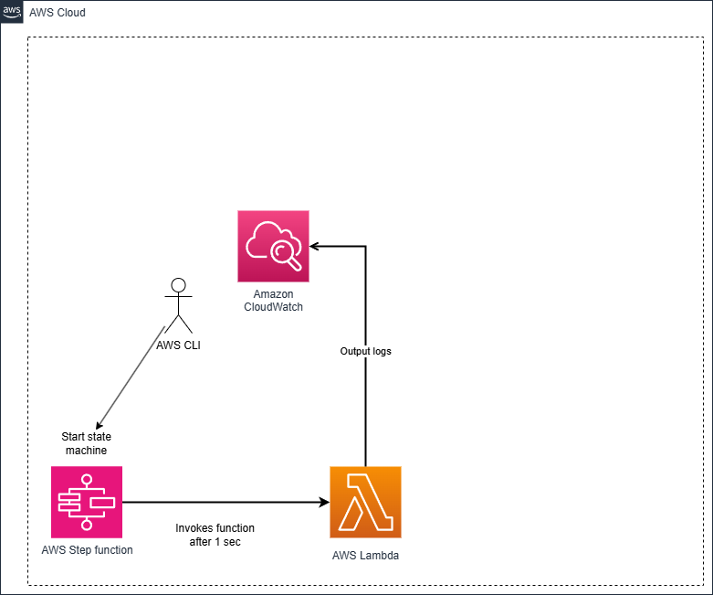

# Step Functions Terraform Setup

This project contains Terraform configurations for setting up AWS Step Functions. The setup includes the definition of a state machine, associated Lambda functions, and necessary configurations.



## Project Structure

- `main.tf`: Contains the main configuration for the Terraform infrastructure, defining the AWS EventBridge rule and the Lambda function.
- `variables.tf`: Defines input variables for the Terraform configuration, specifying types and default values.
- `outputs.tf`: Specifies output values that Terraform will display after applying the configuration, including resource ARNs.
- `provider.tf`: Configures the Terraform provider, typically the AWS provider with necessary authentication details.

## Getting Started

### Prerequisites

- Terraform installed on your machine.
- AWS account with appropriate permissions to create resources.
- AWS CLI configured with your credentials.


### Setup

1. Clone the repository:
   ```
   git clone <repository-url>
   cd step_functions

1.1 Prepare lambda package:
   ```
   cd lambda_package
   zip -r ../lambda.zip .
   cd ..
   ```

2. Initialize Terraform:
   ```
   terraform init
   ```

3. Review and modify the `variables.tf` file as needed to set your desired configurations.

4. Plan the deployment:
   ```
   terraform plan
   ```

5. Apply the configuration:
   ```
   terraform apply
   ```
6. Start State Machine
   ```
    state_machine_arn="<state machine arn from output of terraform apply>"
 1106  aws stepfunctions start-execution   --state-machine-arn "$state_machine_arn"   --input '{"taskId": "12345"}'
   ```
7.  Check logs that show Task ID : 12345 processed successfully 

### Outputs

After applying the configuration, Terraform will display the output values defined in `outputs.tf`, including the ARN of the created resources.

### Cleanup

To remove the resources created by this project, run:
```
terraform destroy
``` 

## License

This project is licensed under the MIT License.